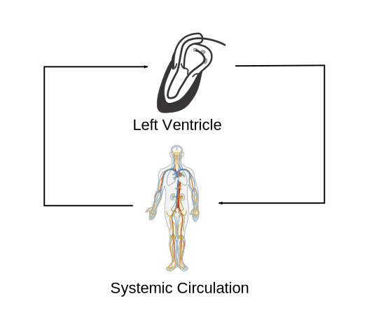

# PV loop simulation

by Christian Winkler, M.Sc.

This repository contains a small program that simulates the pressure and volume in the [left ventricle of the heart](https://en.wikipedia.org/wiki/Heart). The result of the simulation can be visualized as the [PV loop](https://en.wikipedia.org/wiki/Pressure%E2%80%93volume_loop_analysis_in_cardiology), which is often used by cardiologist to analyze the cardiac function of patients.

The end systole (ES) and end diastole (ED) are highlighted in the figure.

PV loop simulation allows to simulate the pressure and volume based on a Lumped Parameter Model (LPM) that is described in the next chapter. The model is based on an ordinary differential equations representing a simplification of the cardiovascular system. The [electronic-hydraulic analogy](https://en.wikipedia.org/wiki/Hydraulic_analogy) was used to create the model.
Parameters like the peripheral resistance (Rp) or the maximal elastance (Emax) have to be defined in advance.

# Usage
Coming soon.

# Model
Coming soon.

# References & other studies
[E. Kung, G. Pennati, F. Migliavacca, T.-Y. Hsia, R. Figliola, A. Marsden, and A. Giardini, “A Simulation Protocol for Exercise Physiology in Fontan Patients Using a Closed Loop Lumped-Parameter Model,” J. Biomech. Eng., vol. 136, no. 8, p. 81007, 2014.](http://biomechanical.asmedigitalcollection.asme.org/article.aspx?articleid=1852723)
## Websites
[Daniel Burkhoff](http://danielburkhoff.com/)

[CVSim](https://physionet.org/physiotools/cvsim/)

[CVSim (Github repository)](https://github.com/MIT-LCP/cvsim)
